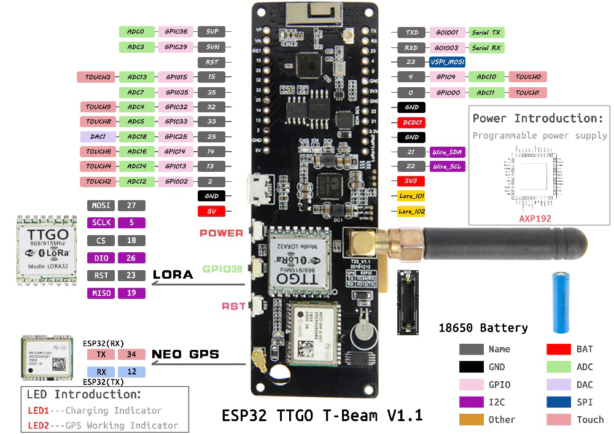
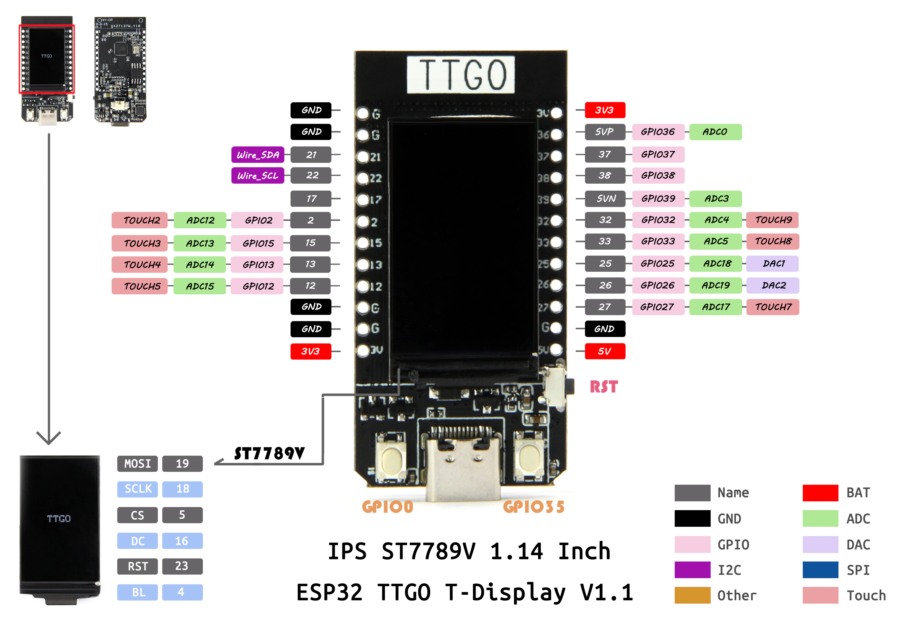

# Imagimob - AFarcCloud project source code
## Edge AI Tractor tracker and cow activity monitoring collar

[](http://www.afarcloud.eu/)[](https://www.imagimob.com/)


This repository contains the code for the sensors firmwares and backend developped during the AFarCloud project as presented at the final demonstrator in Pisa, November 2021.

## Principle 

The platform consists of sensor modules placed on animals or legacy equipement (for the demonstration, we used sensors in collars on cows and on legacy tractors) that collect - among others - accelerometric data, analyze it using a neural network on the sensor to detect high level behavioral patterns and send aggregated data about these over LoRa. The data is then processed and decoded by the backend before behind forwarded to the AFarCloud for further usage. 

### Data captured and labelling

Data capture and labelling is done using small bluetooth enabled sensors from ... and the free [Imagimob Capture app](https://play.google.com/store/apps/details?id=com.imagimob.imagimob_capture&gl=IT). 

The app simultaniously records video and accelerometer data and allows the user to label data as the video is being recorded. 

The labelling can be further improved after capture using [Imagimob Studio](https://developer.imagimob.com/install-imagimob-studio.html)


### Training 

Training of the neural network from labelled data is done using [Imagimob AI devlopment platform](https://www.imagimob.com/products). 

After a satisfactory model has been trained, the platform exports it as pair of C files that contain all the routines and parameters for that particular model. (See the example models developped during AFarCloud in [Model_CowCollars](./Model_CowCollars) and [Model_Tractors](./Model_Tractors)). 

These models require no external dependencies and being nothing more C99-complaint C code, will run on practically any microcontroller platform. 

### Sensors

For the demonstrator, we used two variants of the TTGO familly of boards, centered around ESP32 CPU:




- The T-Beam was used for the smart tractor trackers
- The T-Display was used for the cow collars (due to smaller form factor)

The main difference between the boards is the lack of GPS on the latter. The OLED display was not used in the project and was disabled on the cow collar. 

The boards need at least an additional [Bosch BMI160 accelerometer/gyroscope](https://www.bosch-sensortec.com/products/motion-sensors/imus/bmi160/) and optionally a [Bosch BME280 environmental sensor](https://www.bosch-sensortec.com/products/environmental-sensors/humidity-sensors-bme280/) soldered to the I2C bus. 


### Network

The final demonstrator was run using [The Things Network](https://www.thethingsnetwork.org/), but integrations with the Finnish country-wide LoRa network [Digita](https://www.digita.fi/) as well with self-hosted [lorawan-server](https://github.com/gotthardp/lorawan-server) we tested and available in the backend code. 

### Backend

The backend code consists of a few microservices written in python that receive input from the LoRa network provider and communicate with each-other over MQTT. The services process raw input from the sensor into high level json structures and forward the data to the AFarCloud platform. 

The data is also capture in a postgres database and can be visualized using Grafana allowing some basic usage of the solution independently of the AFarCloud infrastructure. 

The backend stack runs on docker and is currently configured to run entirely on one server. Running the stack in a fully distributed fashion has not been considered in this project. 

All the configurations, states and data generated by the services are stored in the folder ```./data```, i.e. this and only this part needs regular backups.


## Firmware 

The firmware uses Arduino for ESP32. Please refer to [Expressif's official documentation](https://github.com/espressif/arduino-esp32) for setting up the toolchain. 

### Dependencies: 

The following external libraries are required for compiling the firmware: 
- [AXP202X](https://github.com/Imagimob/AXP202X_Library) : Library for controlling the programmable power supply on the V2 TTGO T-beam board. This is the standard library, forked for convenience.  
- [BMI160](https://github.com/Imagimob/BMI160-Arduino) : Library for reading data from the BMI160 acceleremoter/Gyroscope. This is the standard library, forked for convenience.  
- [BME280-I2C-ESP32](https://github.com/Imagimob/BME280-I2C-ESP32) : only required if using the BME280. The version hosted on Imagimob's github repository is customized for this project and backwards compatible with the original library --- but the original version won't work in this project. Note that you will also need to uninstall the official Adafruit BME280 if you have it as it will cause conflict with this one. 


All these dependency should be cloned into your `~/Documents/Arduino/libraries/` folder. 

### Flashing:

Have a look at the `config.h` file and create a `secrets.h` following the example providing with suitable LoRa app and dev UI keys. 

Then, compile and flash just like any other Arduino-compatible board. 


## Backend :

#### Requirements

To run the stack, you will need [docker](https://docs.docker.com/install/) and [docker-compose](https://docs.docker.com/compose/install/). 

#### Configure the stack to your needs

You need to provide a suitable  ```.env``` file with parameters for your specific use case.  An example of .env file is provided in [env.example](./env.example).


#### Prepare the environment:

- Download all necessary docker images:
```
docker-compose pull 
```
- Compile and build everything that needs to be compiled and built locally:
```
docker-compose build
```

 
#### Run the application

For devlopment, you probably want to launch the stack as

```docker-compose -f docker-compose.yml -f docker-compose.localdev.yaml up```


On a production server, you should probably do 
```docker-compose -f docker-compose.yml -f docker-compose.prod.yaml up -d```

The latter t will also call Let's encrypt to get the right certificates and configure an SSL proxy automagically. 


To shut down the entire application:
```docker-compose -f ... -f ... down```


Remember: Docker-compose will automaticall restore the services after a reboot untill a ```docker-compose down```.  


## Troubleshooting

- *I get error messages about undefined environmental variables right after `docker-compose up`* : your .env is mis-configured or you are running the command in a wrong folder.


- *It stopped working and I don't really understand why* : 
```
docker-compose down
docker-compose up -d --force-recreate
```
should get you out of most troubles...

- *Seems I f\*\*\*\* it up more than that*:

```
docker-compose down
docker system prune -a
docker-compose up -d --force-recreate
```

That's maximum possible clean up without touching the application data. If it doesn't work after that, your problem is in your `./data` folder and you shall be careful not to loose data...


- *No way - I can't connect to Postgres...*: You might have attempted to change the user, password or database name in the .env file while your database already existed! You should not do this...

Explanation: the info in .env file is used by Postgres only for initializing the database. Changing it in the .env will not "update" the information in the database automatically, but all clients will take the new user/password upon restart.


If you do not care about your data:
```
docker-compose down
rm -rf ./data/postgis/
docker-compose up -d --force-recreate
```

Otherwise, if you need your data:
```
docker-compose exec postgis /bin/bash
```
and go and fix your database manually using `psql`


Bottom line: if you want to change the Postgres password, change it `.env` first, then change it in Postgres with `psql`, and then restart the services!

